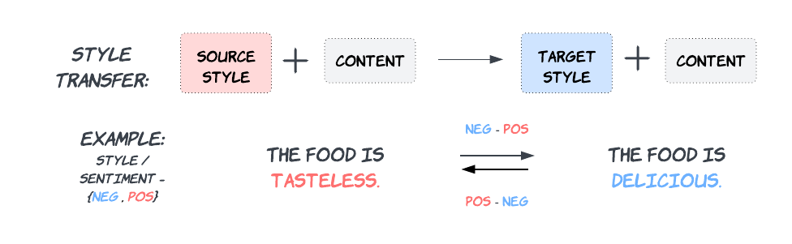

# Leveraging Low-resource Parallel Data for Text Style Transfer

This repo contains the code and data of the paper: [Leveraging Low-resource Parallel Data for Text Style Transfer]().

## Overview

  

Our approach: We (1) built a TST system with low-resource parallel data, (2) applied multiple low-resource adaptation techniques, (3) and a novel style reward approach.

## Walkthrough

### Dependency

    pip install -r requirements.txt

*Will add more information in this section soon.*

## Citing
If you use this data or code please cite the following:
  
    @inproceedings{mukherjee2023leveraging,
author = {Sourabrata Mukherjee and Ondrej Dusek},
title = { Leveraging Low-Resource Parallel Data for Text Style Transfer},
booktitle = {Proceedings of the 16th International Natural Language Generation Conference},
pages = {388--395},
address = {Prague, Czechia},
year = {2023},
}
    author = ,
    title = ,
    booktitle = ,
    year = 
}

## License

    Author: Sourabrata Mukherjee
    Copyright © 2023 Sourabrata Mukherjee.
    Licensed under the MIT License.

## Acknowledgements

This research was supported by Charles University projects GAUK 392221, and SVV 260575, and by the European Research Council (Grant agreement No. 101039303 NG-NLG).

